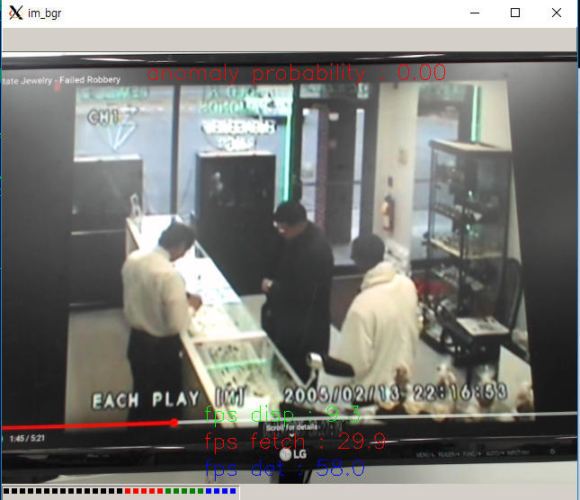
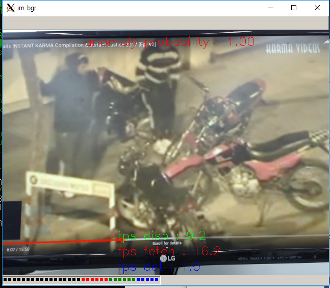

# I am trying to make a camera version of "WaqasSultani/AnomalyDetectionCVPR2018" which reads the stack of every 16 frames from camera and detects anomaly on that 16 frames.  (The GPU version on Titan X seems to work in realtime, 16-frame delayed though.)

You will get an error message for the missing file "c3d_sports_1M_weights.h5" when playing cam version.

The missing C3D weight file, "c3d_sports_1M_weights.h5" could not be uploaded due to spalce limit of my github account.  It can be downloaded from "https://www.dropbox.com/s/ypiwalgtlrtnw8b/c3d-sports1M_weights.h5?dl=0" and should be placed under the "data" folder.

My environmnet was

  * Python : 3.5.6

  * Keras : 1.1.1

  * Theano : 1.0.2
  
  * Titax X (Pascal)  

The command line script for GPU + cam version was

	$ env KERAS_BACKEND=theano CPLUS_INCLUDE_PATH=/usr/local/cuda/include THEANO_FLAGS='mode=FAST_RUN,device=cuda,floatX=float32' python Demo_cam.py

  * The typical frame rates (fetch/detection/display) of GPU + cam version is as the following figure.
  
  

The command line script for GPU + video file version was

	$ env KERAS_BACKEND=theano CPLUS_INCLUDE_PATH=/usr/local/cuda/include THEANO_FLAGS='mode=FAST_RUN,device=cuda,floatX=float32' python Demo_GUI.py

The command line script for CPU + cam version was

	$ env KERAS_BACKEND=theano python Demo_cam.py

  * The typical frame rates of CPU + cam version is as the following figure. (I don't know why fetch rate becomes so low. Maybe detection rate (almost 1 fps) had an influence on it. 
  
  

The command line script for CPU + video file version was

	$ env KERAS_BACKEND=theano python Demo_GUI.py

---

DATASET:

The dataset can be also downloaded from the following link:
https://visionlab.uncc.edu/download/summary/60-data/477-ucf-anomaly-detection-dataset

Below you can find Training/Testing Code for our anomaly Detection project which was published in Computer Vision and Pattern Recognition, CVPR 2018.

The implementation is tested using:

Keras version 1.1.0

Theano 1.0.2

Python 3

Ubuntu 16.04

We used C3D-v1.0 (https://github.com/facebook/C3D) with default settings as a feature extractor.
 
Training_AnomalyDetecor_public.py is to Train Anomaly Detection Model

Testing_Anomaly_Detector_public.py is to test trained Anomaly Detection Model

Save_C3DFeatures_32Segments is to save already computed C3D features for the whole video into 32 segment features.

weights_L1L2.mat: It contains the pre-trained weights for the model ‘model.json’.

Demo_GUI: We have provided a simple GUI which can be used to see results of our approach on sample videos.

SampleVideos: This folder contains C3D features (32 segments) for sample videos. It order to see testing results for the features in this folder, please copy the corrosponding videos in the same folder.

Plot_All_ROC:  This code can be use to plot the ROC results reported in the paper. The data to plot ROCs of methods discussed in the paper can be found in folder Paper_Results.

The project page can be found at: http://crcv.ucf.edu/projects/real-world/

Temporal_Anomaly_Annotation.txt contains ground truth annotations of the testing dataset.

Anomaly_Train.txt contains the video names for training anomaly detector

If you find any bug, or have some questions, please contact Waqas Sultani: waqas5163@gmail.com

Citation:

@InProceedings{Sultani_2018_CVPR,

author = {Sultani, Waqas and Chen, Chen and Shah, Mubarak},

title = {Real-World Anomaly Detection in Surveillance Videos},

booktitle = {The IEEE Conference on Computer Vision and Pattern Recognition (CVPR)},

month = {June},

year = {2018}

}
